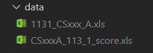
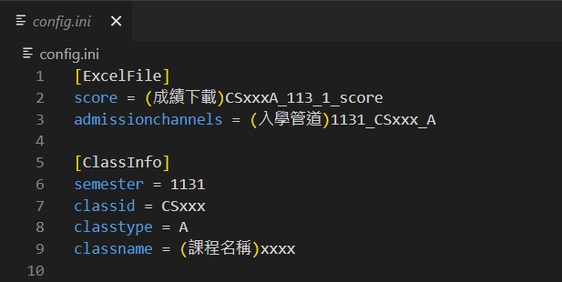
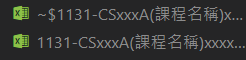
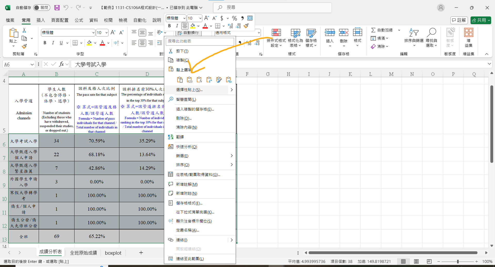

# Yuan Ze University RA Statistic 
>Update time: 2025-01-27

---

## Environment


## Requirements
```bash
pip install -r requirements.txt
```

## Run
### Step 1
In terminal:
```python
python main.py
```
### Step 2
Put the ```admission channels``` and ```total score``` Excel files into the ```data``` folder<br>


Fill in the contents of ```config.ini```<br>


### Step 3
Run the Python file again
```python
python main.py
```

### Result
You can find the output file in the folder.<br>



Next, download the sample file from the cloud and apply the following copy-and-paste method in the three worksheets.<br>


